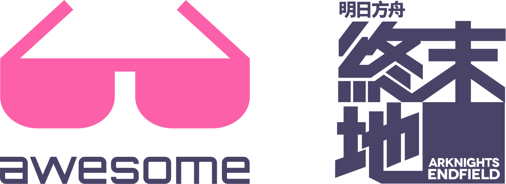

<div align="center" style="text-align: center">
  
</div>

<br />

<h2 align="center">Awesome Arknights Endfield</h2>

<p align="center">
  <a href="https://github.com/sindresorhus/awesome">
    
  </a>

  <a href="./LICENSE.md">
    
  </a>

  <!-- BADGE_COUNT_START -->
  
  <!-- BADGE_COUNT_END -->
</p>

[English](./README.md) | 简体中文

> 与《明日方舟：终末地》相关的精选优质内容列表。

主要收录 [《明日方舟：终末地》](https://endfield.hypergryph.com/) 相关的 **有价值** 的项目，包括但不限于工具、库、插件、资源等。优先收录开源项目，暂不考虑只提供可执行文件的项目。

如果您想了解 [《明日方舟》](https://ak.hypergryph.com/) 相关的内容，请移步 [awesome-arknights](https://github.com/palmcivet/awesome-arknights)。

## 目录

- [目录](#目录)
- [列表](#列表)
- [最近更新](#最近更新)
- [贡献](#贡献)
- [徽标](#徽标)
  - [添加徽标](#添加徽标)
  - [更多样式](#更多样式)
- [协议](#协议)
- [版权](#版权)

## 列表

\>\> 请移步 [LIST.zh-CN.md](./LIST.zh-CN.md) 以查看完整项目列表。

## 最近更新

<!-- RECENT_START -->
- [leostudiooo/typst-touying-theme-endfield](https://github.com/leostudiooo/typst-touying-theme-endfield)
  - 基于 Touying 框架、受《明日方舟：终末地》视觉风格启发的 Typst 演示文稿主题。

- [Wanye-7300/baker-dx](https://github.com/Wanye-7300/baker-dx)
  - [Vercel](https://baker-dx.vercel.app/)
  - 基于 Dioxus 的 Baker 克隆项目，具有会话编辑和回放功能。

- [hsyhhssyy/IndustrialPlanner](https://github.com/hsyhhssyy/IndustrialPlanner)
  - [主页](https://endfield.anonymous-test.top/)
  - 一个运行在浏览器里的《集成工业》产线布置与仿真工具。

- [sssxks/end-cli](https://github.com/sssxks/end-cli)
  - [GitHub Pages](https://sssxks.github.io/end-cli/)
  - [Cloudflare](https://end-8jk.pages.dev/)
  - 源石计划 - 终末地产线规划工具。使用 Rust/WebAssembly 实现的终末地生产线规划工具，支持 CLI 和 Web 版本，基于 HiGHS 求解器实现 MILP 模型求解。

- [bhaoo/endfield-gacha](https://github.com/bhaoo/endfield-gacha)
  - 《明日方舟：终末地》寻访（抽卡）统计工具，支持官服/B服/国际服。
<!-- RECENT_END -->

更多项目请参阅 [LIST.zh-CN.md](./LIST.zh-CN.md)。

## 贡献

如果您发现了未收录在本列表的开源项目或者开源了自己的项目，无论是在开发中还是已归档，只要有价值，都可以被收录，欢迎 Issue、PR 或 Fork。

更多详细步骤请参阅 [CONTRIBUTING.md](./CONTRIBUTING.md) 文件。

## 徽标
### 添加徽标

如果您维护着与《明日方舟：终末地》相关的项目，希望收录在本列表中，欢迎在项目的 README 中添加徽标以示支持：

- Markdown

  ```markdown
  ](https://github.com/palmcivet/awesome-arknights-endfield)
  ```

- HTML

  ```html
  <a href="https://github.com/palmcivet/awesome-arknights-endfield">
    
  </a>
  ```

- 源文件

  直接下载并使用 [badge.svg](./assets/badge.svg) 文件

将会显示如下：


### 更多样式

默认为 `flat` 样式的徽标，如果需要其他样式，可以使用以下链接：

- `flat-square` 

  - Markdown

    ```markdown
    ](https://github.com/palmcivet/awesome-arknights-endfield)
    ```

  - HTML

    ```html
    <a href="https://github.com/palmcivet/awesome-arknights-endfield">
      
    </a>
    ```

  - 源文件

    下载 [badge-flat-square.svg](./assets/badge-flat-square.svg)

- `for-the-badge` 

  - Markdown

    ```markdown
    ](https://github.com/palmcivet/awesome-arknights-endfield)
    ```

  - HTML

    ```html
    <a href="https://github.com/palmcivet/awesome-arknights-endfield">
      
    </a>
    ```

  - 源文件

    下载 [badge-for-the-badge.svg](./assets/badge-for-the-badge.svg)

## 协议

本项目采用 MIT 许可证。详情请参阅 [LICENSE](./LICENSE.md) 文件。

## 版权

本项目仅用于收录《明日方舟：终末地》（Arknights: Endfield）相关的资源和开源项目，对所收录项目的有效性和合法性不作保证，用户须审慎使用本项目以及所收录项目，一切后果须自行承担，与本项目无关。

《明日方舟：终末地》这一 IP 及其版权归属 [上海鹰角网络有限公司](https://www.hypergryph.com/) 所有。不得用于商业用途，不得损害版权方的利益。
