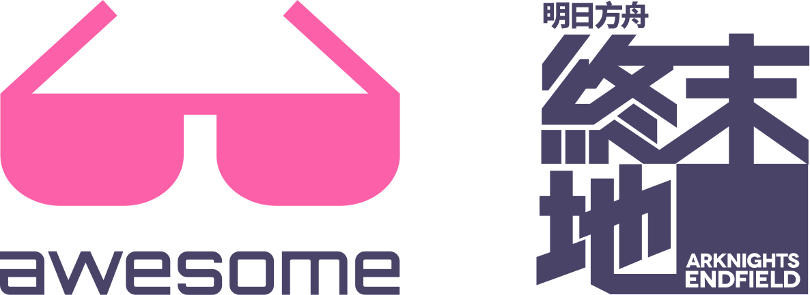

<div align="center" style="text-align: center">
  
</div>

<br />

<h2 align="center">Awesome Arknights Endfield</h2>

<p align="center">
  <a href="https://github.com/sindresorhus/awesome">
    
  </a>

  <a href="./LICENSE.md">
    
  </a>

  <a href="https://github.com/palmcivet/awesome-arknights-endfield/actions/workflows/deploy.yml">
    
  </a>

  <a href="https://palmcivet.github.io/awesome-arknights-endfield/">
    
  </a>

  <!-- BADGE_COUNT_START -->
  
  <!-- BADGE_COUNT_END -->
</p>

[English](./README.md) | 简体中文

> 与《明日方舟：终末地》相关的精选优质内容列表。

主要收录 [《明日方舟：终末地》](https://endfield.hypergryph.com/) 相关的 **有价值** 的项目，包括但不限于工具、库、插件、资源等。优先收录开源项目，暂不考虑只提供可执行文件的项目。

如果您想了解 [《明日方舟》](https://ak.hypergryph.com/) 相关的内容，请移步 [awesome-arknights](https://github.com/palmcivet/awesome-arknights)。

## 目录

- [目录](#目录)
- [列表](#列表)
- [最近更新](#最近更新)
- [贡献](#贡献)
- [徽标](#徽标)
  - [添加徽标](#添加徽标)
  - [更多样式](#更多样式)
- [协议](#协议)
- [版权](#版权)

## 列表

\>\> 请移步 [LIST.zh-CN.md](./LIST.zh-CN.md) 以查看完整项目列表。

## 最近更新

<!-- RECENT_START -->
- [genrusaii/endfield-playtime-checker](https://github.com/genrusaii/endfield-playtime-checker)
  - 本地 PowerShell 脚本，通过分析《明日方舟：终末地》游戏日志计算总游玩时长、会话记录和活跃连续天数。

- [SusieGlitter/perlica](https://github.com/SusieGlitter/perlica)
  - [GitHub Pages](https://susieglitter.github.io/perlica/)
  - 使用 Three.js 实时渲染的宣传型单页动画：佩丽卡沿方兴衢道路网骑行程序化重建的武陵城，支持自动巡游与自由操控。

- [rmxlinux/EndfieldData](https://github.com/rmxlinux/EndfieldData)
  - 《明日方舟：终末地》TableCfg、Lua、ExtendData 和 Json 数据备份，由脚本生成，当前已支持 1.5 版本。

- [QinAnze/zmd-manager](https://github.com/QinAnze/zmd-manager)
  - 仿《明日方舟：终末地》电量系统风格的本机任务与性能监视器，基于 Tauri 2 壳与本地采集端，展示 CPU、显卡、内存、磁盘和网络占用。

- [rison114514/dsh-endfield-ui](https://github.com/rison114514/dsh-endfield-ui)
  - 非官方《明日方舟：终末地》工业风 DeepSeek Harness 界面插件与桌面工作台，提供 better-sidebar 布局，并与原生 Goal 同步。
<!-- RECENT_END -->

更多项目请参阅 [LIST.zh-CN.md](./LIST.zh-CN.md)。

## 贡献

如果您发现了未收录在本列表的开源项目或者开源了自己的项目，无论是在开发中还是已归档，只要有价值，都可以被收录，欢迎 Issue、PR 或 Fork。

更多详细步骤请参阅 [CONTRIBUTING.md](./CONTRIBUTING.md) 文件。

## 徽标
### 添加徽标

如果您维护着与《明日方舟：终末地》相关的项目，希望收录在本列表中，欢迎在项目的 README 中添加徽标以示支持：

- Markdown

  ```markdown
  ](https://github.com/palmcivet/awesome-arknights-endfield)
  ```

- HTML

  ```html
  <a href="https://github.com/palmcivet/awesome-arknights-endfield">
    
  </a>
  ```

- 源文件

  直接下载并使用 [badge.svg](./assets/badge.svg) 文件

将会显示如下：


### 更多样式

默认为 `flat` 样式的徽标，如果需要其他样式，可以使用以下链接：

- `flat-square` 

  - Markdown

    ```markdown
    ](https://github.com/palmcivet/awesome-arknights-endfield)
    ```

  - HTML

    ```html
    <a href="https://github.com/palmcivet/awesome-arknights-endfield">
      
    </a>
    ```

  - 源文件

    下载 [badge-flat-square.svg](./assets/badge-flat-square.svg)

- `for-the-badge` 

  - Markdown

    ```markdown
    ](https://github.com/palmcivet/awesome-arknights-endfield)
    ```

  - HTML

    ```html
    <a href="https://github.com/palmcivet/awesome-arknights-endfield">
      
    </a>
    ```

  - 源文件

    下载 [badge-for-the-badge.svg](./assets/badge-for-the-badge.svg)

## 协议

本项目采用 MIT 许可证。详情请参阅 [LICENSE](./LICENSE.md) 文件。

## 版权

本项目仅用于收录《明日方舟：终末地》（Arknights: Endfield）相关的资源和开源项目，对所收录项目的有效性和合法性不作保证，用户须审慎使用本项目以及所收录项目，一切后果须自行承担，与本项目无关。

《明日方舟：终末地》这一 IP 及其版权归属 [上海鹰角网络有限公司](https://www.hypergryph.com/) 所有。不得用于商业用途，不得损害版权方的利益。
